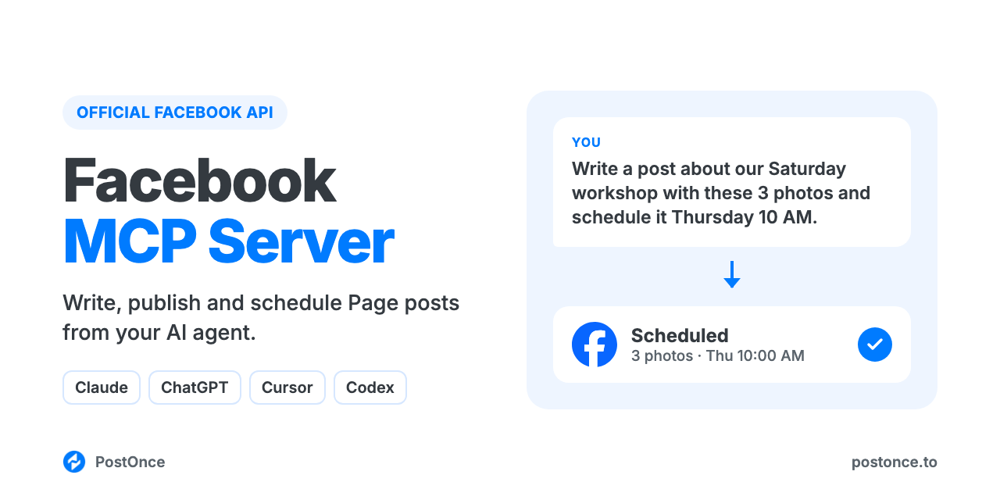

<p align="center"></p>

# Facebook MCP Server

Facebook MCP server for Claude, ChatGPT, Cursor and Codex. Your AI agent can write, publish and schedule posts, photos and Reels on your Facebook Page through Facebook's official API. There's no scraping, no browser automation and no Facebook developer app to set up.

It runs on [PostOnce](https://postonce.to)'s hosted MCP server and comes with Facebook skills for Page posts, Reel scripts and content calendars, so your agent knows what works on a Facebook Page before it posts.

```
You:    Write a Facebook post for our bakery page announcing the new sourdough
        class, with these 3 photos, and schedule it for Thursday 10am.
Claude: Drafted it with the facebook-post-generator skill. The first line
        gives the date and what people will bake; the booking link is in the
        last line. Scheduled on PostOnce for Thu 10:00 on "Rise Bakery".
```

Full setup guide with examples: [postonce.to/mcp/facebook](https://postonce.to/mcp/facebook)

## What you can do

| Ask your agent to | How it works |
| --- | --- |
| Publish a text post now, with or without a link | `create_post` on your connected Facebook Page |
| Schedule a post for later | `create_post` with `publish_at` |
| Post one photo or up to 10 photos | `create_upload_url`, upload, then `create_post` with `media` |
| Post a video as a Reel (9:16, at least 540×960) | Upload one video, then `create_post`; every video posts as a Reel |
| Set the Reel cover | `thumbnail_url` on the video |
| Post to any Page you manage | Pick the Page from `list_accounts` |
| Save a draft to finish later | `create_draft` |
| Check whether a post went out, and get its URL | `get_post` |
| Change or cancel a scheduled post | `update_post`, `cancel_post` |
| Post the same thing to Facebook and other platforms | Add more targets to `create_post` (Instagram, TikTok, YouTube, LinkedIn, X, Threads, Pinterest, Bluesky) |

Not supported: personal profiles, Groups, Facebook Stories, regular (non-Reel) video posts, mixing photos and video in one post, analytics, reading or replying to comments, Messenger, and editing or deleting posts after they're published. Links in the post text use Facebook's own link preview.

## Setup (about a minute)

You need a [PostOnce account](https://postonce.to) (free for 7 days, no card) with your Facebook Page connected.

**Claude (claude.ai and desktop) and ChatGPT:** add a custom connector with the URL below and sign in with PostOnce. No API key.

```
https://postonce.to/mcp
```

Step-by-step: [Claude](https://postonce.to/integrations/claude) · [ChatGPT](https://postonce.to/integrations/chatgpt)

**Claude Code, Codex and Cursor:** install the plugin. It adds the MCP connection and the skills together. Claude Code asks you to sign in to PostOnce the first time you use it (or run `/mcp` and pick postonce), so there's no key to copy. In Codex and Cursor, create an API key in [PostOnce preferences](https://postonce.to/dashboard/preferences) and give it to your client as the `POSTONCE_API_KEY` environment variable. Never paste the key into chat.

```bash
# Claude Code
claude plugin marketplace add postoncehq/plugins
claude plugin install facebook-mcp@postoncehq
```

Step-by-step: [Claude Code](https://postonce.to/integrations/claude-code) · [Codex](https://postonce.to/integrations/codex) · [Cursor](https://postonce.to/integrations/cursor)

**Any other MCP client:** point it at `https://postonce.to/mcp` (Streamable HTTP) with the header `Authorization: Bearer <your PostOnce API key>`.

## Skills included

| Skill | What it does |
| --- | --- |
| [`facebook-post-generator`](skills/facebook-post-generator/SKILL.md) | Writes Facebook Page posts and captions for text, link, single-photo and multi-photo posts, with one clear call to action. |
| [`facebook-reel-script`](skills/facebook-reel-script/SKILL.md) | Writes vertical Reel scripts with a hook, beats, on-screen text and the caption, or adapts a TikTok or Instagram Reel for Facebook. |
| [`facebook-page-description`](skills/facebook-page-description/SKILL.md) | Writes the Page intro and About copy, for you to paste into your Page settings. |
| [`facebook-content-calendar`](skills/facebook-content-calendar/SKILL.md) | Plans 1 to 4 weeks of Page posts and Reels from your goals or a source you already have, then schedules them. |
| [`postonce`](skills/postonce/SKILL.md) | Publishing workflow: pick the right account, upload media, schedule, and confirm the post actually went live. |

## FAQ

**Is there an official Facebook MCP server?**
This server uses Facebook's official API through PostOnce. Your agent talks to PostOnce over MCP, and PostOnce publishes to your Page with the permissions you grant when you connect.

**Can Claude post to a Facebook Page?**
Yes, once it's connected to an MCP server that can publish, like this one. Claude writes the post, uploads any photos or video, then calls `create_post`.

**Is it safe for my Facebook account?**
Yes. Posts go through Meta's official API. Many Facebook MCP servers on GitHub drive a logged-in browser session or an unofficial, scraped API instead, which Meta's terms don't allow and which can get accounts restricted.

**Do I need a Facebook developer app or API approval?**
No. PostOnce holds the Facebook API access; you just connect your Page.

**Can it post to my personal profile or a Facebook Group?**
No. It posts to Facebook Pages you manage. Facebook's API doesn't allow apps to publish to personal profiles, and Groups aren't supported.

**Can it post Facebook Reels?**
Yes. Every video posts as a Reel, so send a vertical 9:16 video at least 540×960. You can set the cover with a thumbnail image.

**Is it free?**
The skills and this repo are free and MIT-licensed. Publishing runs through a PostOnce account, which you can try free for 7 days without entering a card. After that, see [pricing](https://postonce.to/pricing).

## Other platforms

The same connection posts everywhere PostOnce supports. Platform repos with their own skills:
[LinkedIn MCP](https://github.com/postoncehq/linkedin-mcp) · [Instagram MCP](https://github.com/postoncehq/instagram-mcp) · [TikTok MCP](https://github.com/postoncehq/tiktok-mcp) · [YouTube MCP](https://github.com/postoncehq/youtube-mcp) · [X (Twitter) MCP](https://github.com/postoncehq/x-mcp) · [Threads MCP](https://github.com/postoncehq/threads-mcp) · [Bluesky MCP](https://github.com/postoncehq/bluesky-mcp) · [Pinterest MCP](https://github.com/postoncehq/pinterest-mcp)

## License

MIT. See [LICENSE](LICENSE).
